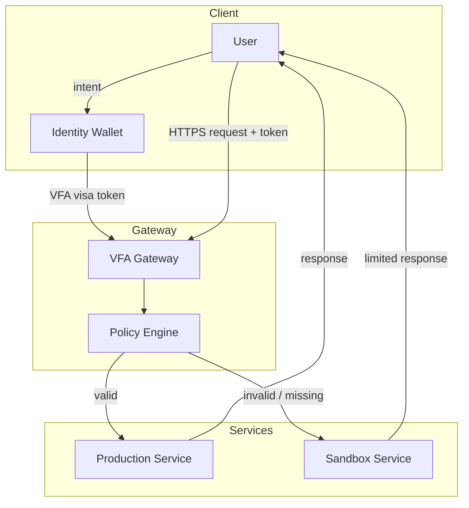
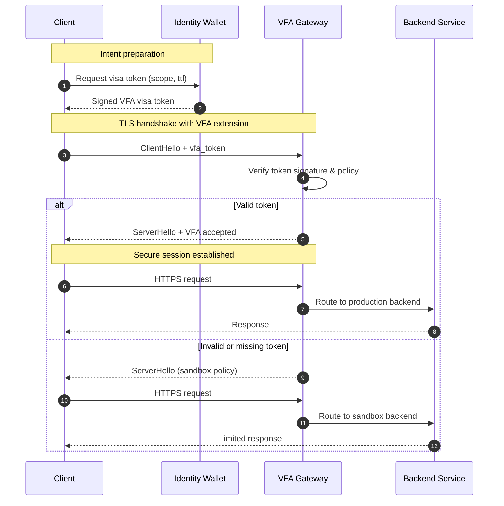
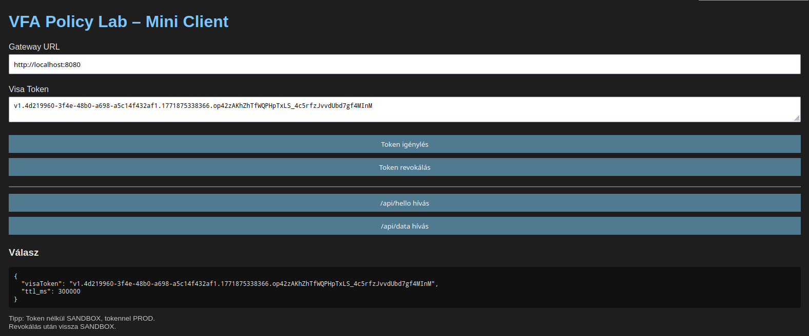
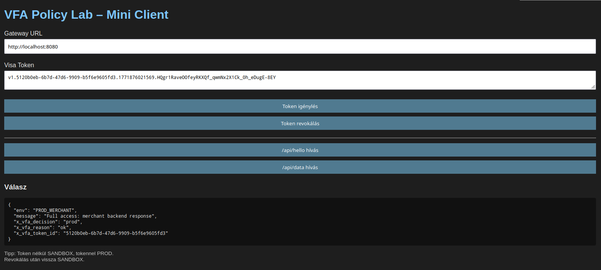
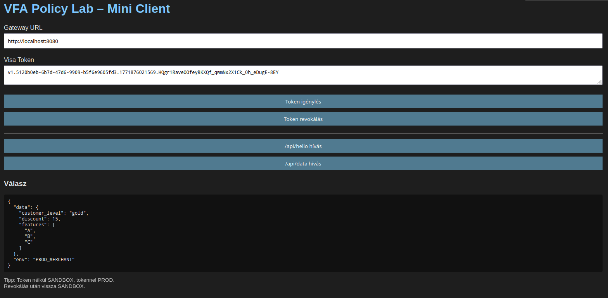
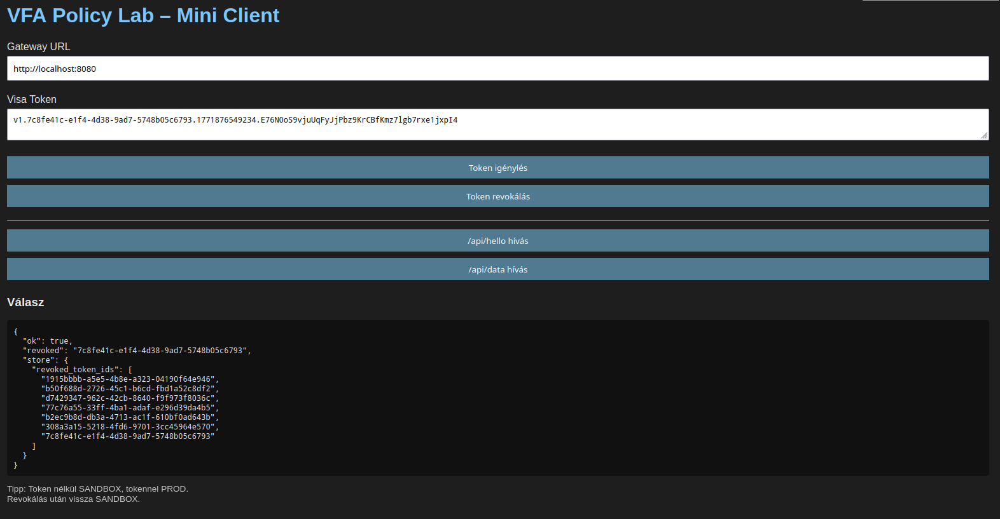
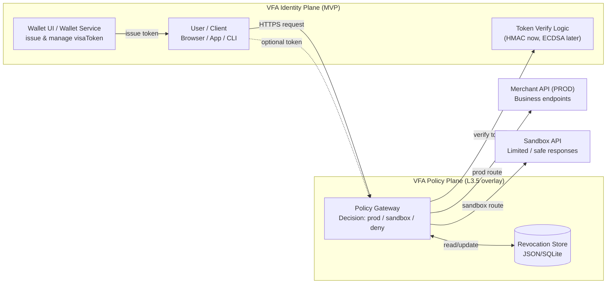
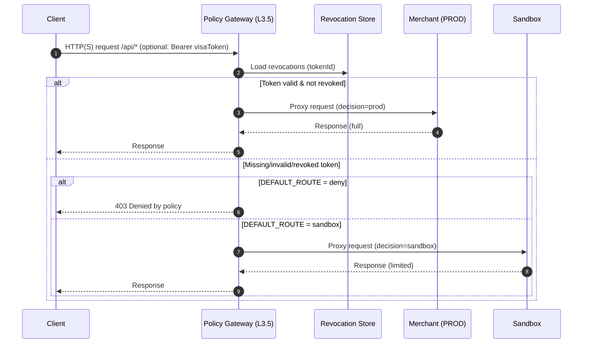
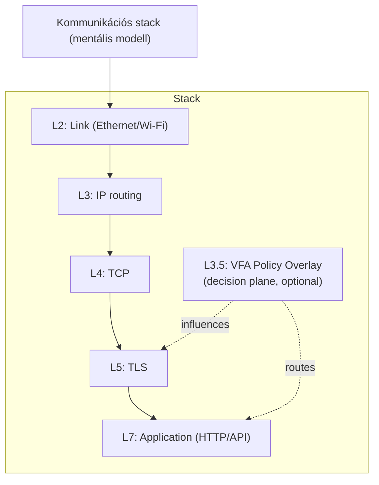

# VFA-Lab — Virtual Flow Agreement Demo

> A policy-driven trust gateway that routes requests using cryptographic visa tokens.

## Related repositories

Implementation and demonstration projects:

- **VFA-MVP** – wallet / merchant reference implementation → https://github.com/Csnyi/VFA-MVP
- **VFA-Lab** — architecture sandbox and gateway routing demo
- **VFA-cloud-PoC** — cloud operation PoC (deployment scenario) → https://github.com/Csnyi/VFA-cloud-PoC
- **VFA-Spec** - protocol specification → https://github.com/Csnyi/VFA-Spec


⚠ Experimental research prototype  
⚠ Not production ready

Minimal, end-to-end demonstration of a **policy-driven trust gateway** that routes traffic based on a signed visa token.

This lab shows how an application-layer decision engine can dynamically route requests between **sandbox** and **production** backends using cryptographic proof.

---

## What this demo demonstrates

* Policy-driven routing at the gateway
* Signed visa token verification
* Automatic downgrade to sandbox
* Token revocation
* Zero-trust style access control
* Developer-friendly observability

---

## Architecture



### TLS Handshake with VFA Extension (Concept)



VFA introduces an optional handshake extension where a **cryptographically signed visa token** can be presented during connection establishment.

The gateway evaluates the token and decides whether the request should be routed to **production services** or **sandbox environments**.

This approach enables **policy-driven trust decisions before application logic is executed.**

### Components

| Service  | Role                            |
| -------- | ------------------------------- |
| gateway  | Decision engine + reverse proxy |
| merchant | Production backend              |
| sandbox  | Limited backend                 |
| client   | Demo UI                         |

---

## Requirements

- Docker Engine 24+
- Docker Compose V2
- curl (optional)
- jq (optional, for pretty output)

## Quick start

### 1. Build and start

```bash
docker compose up -d --build
```

### 2. Open the demo client

The demo client is served by the gateway.

Once the gateway is running, open:

```
http://localhost:8080
```

The client files are located in:

```
gateway/client/
```

The gateway exposes them via:

```javascript
app.use("/", express.static(path.join(__dirname, "client")));
```

### Expected result

After starting the stack you should be able to:

1. Open the demo UI  
   http://localhost:8080

2. Issue a visa token

3. Call the API with and without the token and observe routing decisions.

## Services and ports

| Service           | URL                   |
| ----------------- | --------------------- |
| Gateway + Client  | http://localhost:8080 |
| Merchant (direct) | http://localhost:5000 |
| Sandbox (direct)  | http://localhost:5001 |

---

## Basic flow

### Without token

```
GET /api/hello
→ routed to SANDBOX
```

### With valid token

```
POST /issue → visaToken
GET /api/hello (Authorization: Bearer …)
→ routed to PROD
```

---

## Token lifecycle

### Issue token

```bash
curl -X POST http://localhost:8080/issue \
  -H "Content-Type: application/json" \
  -d '{"ttl_ms":60000}'
```

### Use token

```bash
curl http://localhost:8080/api/hello \
  -H "Authorization: Bearer <visaToken>"
```

### Revoke token

```bash
curl -X POST http://localhost:8080/revoke \
  -H "Content-Type: application/json" \
  -d '{"visaToken":"<visaToken>"}'
```

---

## Policy configuration

Gateway behavior is controlled via environment variables.

### DEFAULT_ROUTE

Controls behavior when no token is present.

| Value   | Behavior                 |
| ------- | ------------------------ |
| sandbox | default → limited access |
| prod    | allow full access        |
| deny    | block request            |

Example in `docker-compose.yml`:

```yaml
DEFAULT_ROUTE=sandbox
```

---

## Decision logic

The gateway evaluates:

1. Token present?
2. Signature valid?
3. Token revoked?
4. Token expired?

Then routes:

```
valid token → PROD
invalid/missing → SANDBOX (or DENY by policy)
```

---

## Observability

Gateway logs include:

* timestamp
* path
* decision
* reason
* token id

Example:

```json
{
  "decision": "sandbox",
  "reason": "missing_token"
}
```

---

## Useful test commands

### Sandbox (no token)

```bash
curl http://localhost:8080/api/hello
```

### With token

```bash
TOKEN=$(curl -s -X POST http://localhost:8080/issue \
  -H "Content-Type: application/json" \
  -d '{"ttl_ms":60000}' | jq -r .visaToken)

curl http://localhost:8080/api/hello \
  -H "Authorization: Bearer $TOKEN"
```

---

## Demo limitations (by design)

This is an MVP lab environment.

Not included (yet):

* audience binding
* device binding
* nonce / replay protection
* distributed revocation
* key rotation

---

## Possible next steps

* scope-based routing
* risk scoring
* ECDSA tokens
* mTLS upstream
* distributed revocation list
* hardware-backed keys

---

## License

Apache License
Version 2.0, January 2004
http://www.apache.org/licenses/

Copyright 2026 Sandor Csicsai

Licensed under the Apache License, Version 2.0 (the "License");
you may not use this file except in compliance with the License.
You may obtain a copy of the License at

    http://www.apache.org/licenses/LICENSE-2.0

Unless required by applicable law or agreed to in writing, software
distributed under the License is distributed on an "AS IS" BASIS,
WITHOUT WARRANTIES OR CONDITIONS OF ANY KIND, either express or implied.
See the License for the specific language governing permissions and
limitations under the License.

---

## About

VFA (Virtual Flow Agreement) explores a **policy-driven trust layer** that can operate between clients and services without modifying the application protocol itself.

---

## Security note

This repository is a **demonstration environment**.

The implementation included here is intended only to illustrate the **VFA policy decision concept** and **must not be used in production systems**.

### Demo secret

The project uses a **shared HMAC secret** for demonstration purposes.

This mechanism is intentionally simplified and does **not** represent a production-grade security design.

### Production requirements

Any real deployment MUST implement:

* secure key storage
* key rotation
* audience binding
* replay protection
* proper authentication hardening

For further details and recommended production practices see
[SECURITY.md](docs/SECURITY.md)

---

**FlowAccord concept demo**

## Demo

request token

api/hello

api/data

revocation


## System-level architecture (VFA-MVP + vfa-lab together)



## Request-level process (what happens with a request)



## Layer diagram (where L3.5 sits)


